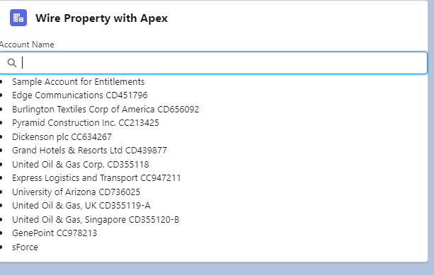
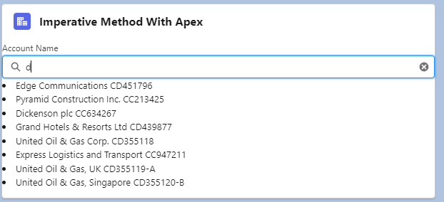

## Call Apex method from Lightning Web Components(LWC)

After importing the apex class method you can call the apex methods as functions into the component by calling either via the wire service or imperatively. To call an Apex method, a Lightning web component can:

-Wire a property
-Wire a function
-Call a method imperatively

To expose an Apex method to a Lightning web component, the method must be static and either global or public. Annotate the method with @AuraEnabled

NOTE :- For Imperative method we dont need to mark the apex method as cacheabe=true.

### Wire a Property & Wire a Function

### Imperative Method With Apex

